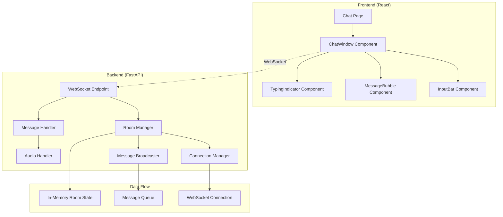

# Design Document

## Overview

This design implements the WebSocket backend infrastructure to complete Phase 1 of the AI-powered multilingual chat application. The system will provide real-time text and voice messaging through FastAPI WebSocket endpoints, integrating with the existing React frontend components to enable room-based communication via shareable URLs.

The design focuses on creating a robust, scalable WebSocket server that can handle multiple concurrent chat rooms, manage user connections, and facilitate real-time message broadcasting while maintaining clean separation between frontend and backend concerns.

## Architecture

### High-Level Architecture



### Component Interaction Flow

1. **Connection Establishment**: Frontend connects to `/ws/chat/{roomId}` endpoint
2. **Room Management**: Backend manages room membership and connection state
3. **Message Processing**: Handles text messages, voice blobs, and typing indicators
4. **Broadcasting**: Distributes messages to all room participants
5. **Error Handling**: Graceful connection management and error recovery

## Components and Interfaces

### Backend Components

#### 1. WebSocket Endpoint (`/ws/chat/{roomId}`)

**Purpose**: Main entry point for WebSocket connections, handles connection lifecycle and message routing.

**Interface**:
```python
@app.websocket("/ws/chat/{room_id}")
async def websocket_endpoint(websocket: WebSocket, room_id: str)
```

**Responsibilities**:
- Accept WebSocket connections
- Validate room_id format
- Delegate to ConnectionManager for room membership
- Route messages to appropriate handlers

#### 2. ConnectionManager

**Purpose**: Manages active WebSocket connections and room membership.

**Interface**:
```python
class ConnectionManager:
    async def connect(self, websocket: WebSocket, room_id: str, user_id: str)
    async def disconnect(self, websocket: WebSocket, room_id: str)
    async def broadcast_to_room(self, room_id: str, message: dict)
    def get_room_connections(self, room_id: str) -> List[WebSocket]
```

**Data Structures**:
- `active_connections: Dict[str, List[WebSocket]]` - Room to connections mapping
- `connection_metadata: Dict[WebSocket, ConnectionInfo]` - Connection details

#### 3. MessageHandler

**Purpose**: Processes different message types and coordinates responses.

**Interface**:
```python
class MessageHandler:
    async def handle_text_message(self, message: TextMessage, room_id: str)
    async def handle_voice_message(self, audio_data: bytes, room_id: str, user_id: str)
    async def handle_typing_indicator(self, typing_data: TypingMessage, room_id: str)
```

#### 4. RoomManager

**Purpose**: Manages room lifecycle, cleanup, and metadata.

**Interface**:
```python
class RoomManager:
    def create_room(self, room_id: str) -> Room
    def get_room(self, room_id: str) -> Optional[Room]
    async def cleanup_empty_rooms(self)
    def is_valid_room_id(self, room_id: str) -> bool
```

### Frontend Integration Points

#### 1. WebSocket Connection Management

The existing `ChatWindow` component already implements WebSocket connection logic that aligns with this design:

- Connection URL: `ws://localhost:8000/ws/chat/{roomId}`
- Message format: JSON for text/control, binary for audio
- Connection state management with reconnection logic

#### 2. Message Protocol

**Text Messages**:
```typescript
interface TextMessage {
  type: 'message';
  from: string;
  to: string;
  text: string;
  lang: string;
  timestamp: string;
}
```

**Typing Indicators**:
```typescript
interface TypingMessage {
  type: 'typing';
  from: string;
  to: string;
  isTyping: boolean;
}
```

**Voice Messages**:
```typescript
interface VoiceMessage {
  type: 'voice';
  from: string;
  to: string;
  audioData: ArrayBuffer;
  timestamp: string;
}
```

## Data Models

### Backend Models

#### Connection Information
```python
@dataclass
class ConnectionInfo:
    user_id: str
    room_id: str
    connected_at: datetime
    last_activity: datetime
```

#### Room State
```python
@dataclass
class Room:
    room_id: str
    created_at: datetime
    active_connections: int
    last_activity: datetime
```

#### Message Models
```python
class BaseMessage(BaseModel):
    type: str
    from_user: str
    timestamp: str

class TextMessage(BaseMessage):
    type: Literal["message"]
    to_user: str
    text: str
    lang: str = "en"

class TypingMessage(BaseMessage):
    type: Literal["typing"]
    to_user: str
    is_typing: bool

class VoiceMessage(BaseMessage):
    type: Literal["voice"]
    to_user: str
    audio_size: int
```

### Frontend Models

The existing frontend models in `MessageBubble.tsx` are well-designed and compatible:

```typescript
interface Message {
  from: string;
  to: string;
  text: string;
  lang: string;
  timestamp: string;
  status: "sending" | "sent" | "delivered" | "read";
}
```

## Error Handling

### Connection Errors

1. **Invalid Room ID**: Return 400 with error message
2. **Connection Limit**: Implement per-room connection limits
3. **WebSocket Errors**: Log and clean up resources gracefully
4. **Network Issues**: Frontend implements exponential backoff reconnection

### Message Errors

1. **Invalid Message Format**: Send error response to sender only
2. **Audio Processing Errors**: Fallback to error message
3. **Broadcasting Failures**: Remove failed connections from room

### Recovery Strategies

1. **Automatic Reconnection**: Frontend implements reconnection with exponential backoff
2. **Connection Cleanup**: Backend removes stale connections automatically
3. **Room Cleanup**: Empty rooms are cleaned up after timeout period
4. **Error Logging**: Comprehensive logging for debugging and monitoring

## Testing Strategy

### Unit Tests

1. **ConnectionManager Tests**:
   - Connection establishment and cleanup
   - Room membership management
   - Message broadcasting logic

2. **MessageHandler Tests**:
   - Text message processing
   - Voice message handling
   - Typing indicator management

3. **RoomManager Tests**:
   - Room creation and validation
   - Cleanup logic
   - Room state management

### Integration Tests

1. **WebSocket Endpoint Tests**:
   - Connection lifecycle
   - Message routing
   - Error handling

2. **Multi-User Scenarios**:
   - Multiple connections per room
   - Cross-room isolation
   - Concurrent message handling

### End-to-End Tests

1. **Frontend-Backend Integration**:
   - Complete message flow
   - Connection recovery
   - Voice message transmission

2. **Performance Tests**:
   - Multiple concurrent rooms
   - High message volume
   - Connection limits

### Test Infrastructure

- **Mock WebSocket Clients**: For backend testing
- **Test Room IDs**: Predictable IDs for testing
- **Audio Test Data**: Sample audio blobs for voice testing
- **Connection Simulation**: Tools for simulating network issues

## Implementation Considerations

### Performance Optimizations

1. **Connection Pooling**: Efficient WebSocket connection management
2. **Message Queuing**: Async message processing to prevent blocking
3. **Memory Management**: Cleanup of inactive connections and rooms
4. **Binary Data Handling**: Efficient audio blob transmission

### Scalability Preparations

1. **Room Isolation**: Messages only broadcast within rooms
2. **Connection Limits**: Prevent resource exhaustion
3. **Cleanup Mechanisms**: Automatic resource cleanup
4. **Monitoring Hooks**: Preparation for metrics collection

### Security Considerations

1. **Room ID Validation**: Prevent injection attacks
2. **Message Sanitization**: Validate all incoming data
3. **Rate Limiting**: Prevent spam and abuse
4. **Connection Limits**: Per-room and per-IP limits

### Development Workflow

1. **Backend First**: Implement WebSocket infrastructure
2. **Protocol Testing**: Verify message formats with frontend
3. **Integration Testing**: End-to-end functionality
4. **Performance Validation**: Load testing and optimization